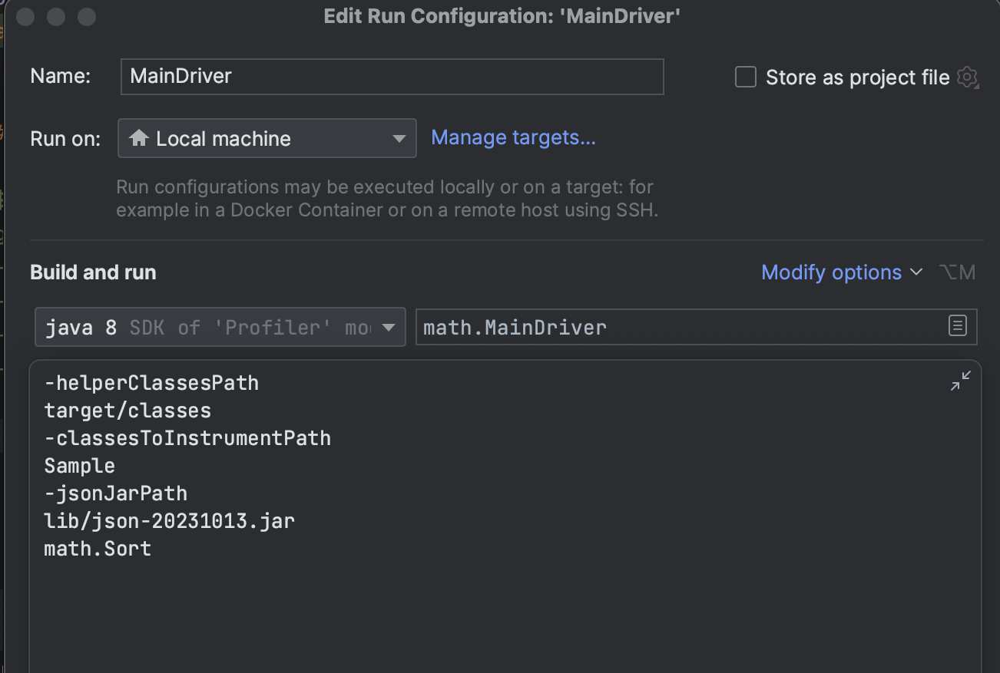
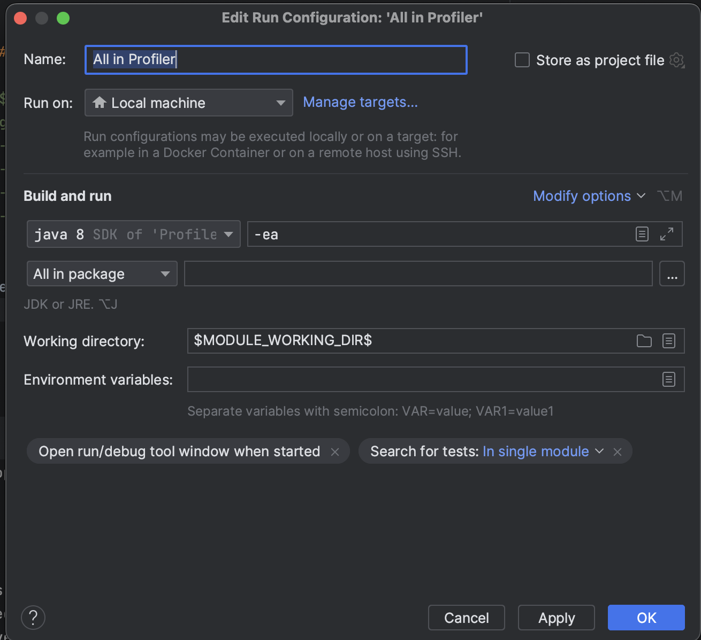

# Assignment 2

## Instructions to Use the Tool

### Prerequisites:
- Java Development Kit 8
- Maven
- Git
- Soot

### Obtaining the Code:

Clone the repository by executing the following command in your terminal:

```bash
git clone https://github.com/nakhlarafi/coverage-report-gen.git
```

### Running the Code:

1. Execute `MainDriver.java`.
2. Pass the following arguments:

```bash
-helperClassesPath target/classes -classesToInstrumentPath Sample -jsonJarPath lib/json-20231013.jar math.Sort
```

- `helperClassesPath`: Path to the helper class.
- `classesToInstrumentPath`: Path to the root folder of the file to be instrumented.
- `jsonJarPath`: Path to the JSON jar. The `lib` folder contains the necessary jar files.
- The final argument is the package name of the file.



## Generating Tests with Randoop

### Generate Test Cases:

After setting up Randoop's environment, generating JUnit test cases can be done using this single command. Assuming your current working directory is the root directory of `Subject-PA2`, run:

```bash
java -classpath ${RANDOOP_JAR}:Sample/ randoop.main.Main gentests --testclass=math.Sort --time-limit=60 --junit-package-name=math --junit-output-dir=tests
```

#### Notes on the Randoop Parameters:

- `${RANDOOP_JAR}`: This should be replaced with the path to `randoop-all-4.3.2.jar` on your computer.
- `gentests`: Command to generate tests using Randoop.
- `--testclass`: Specifies the class under test.
- `--time-limit`: Time limit for test case generation in seconds.
- `--junit-package-name`: Package name for the generated test cases.
- `--junit-output-dir`: Directory for the generated test cases.

### Run the tests
After generating the tests run the tests using `Junit`



### Access the results
The generated result can be found in the `reports` folder. In the folder:
* methodBranchCounts.txt contains the total branch counts
* methodStatementCounts.txt contains the total statement counts
* output.json contains the coverage result

The `output.json` is structured as below:
```json
{
    "Branch Coverage": {
        "method_signature": {
            "coverage": "percentage",
            "total": "total_branches",
            "executed": "executed_branches"
        },
        ...
    },
    "Statement Coverage": {
        "method_signature": {
            "coverage": "percentage",
            "total": "total_statements",
            "executed": "executed_statements"
        },
        ...
    }
}
```
We can also find the coverage results as an output when we run it.


